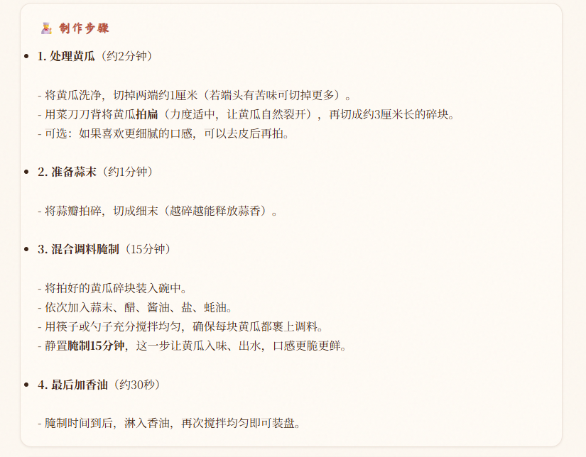

# 🍽️ 尝尝咸淡 · AI 智能食谱助手

基于 **LangChain + FAISS + DeepSeek** 的中文烹饪食谱 RAG（检索增强生成）系统。支持从上百道中文食谱中智能检索，结合大语言模型为用户提供分步骤的烹饪指导、菜品推荐和食材查询。

<p align="center">
  <em>「今天吃什么？」—— 让 AI 替你回答这个世纪难题。</em>
</p>

---

## 📸 系统预览

<!-- TODO: 替换为你的实际截图 -->

### 主界面 — 智能问答


> *自然语言搜索 + 流式打字机输出，支持菜品卡片列表 / 分步骤指导 / 一般问答三种模式自动切换*

### 每日推荐


> *结合农历、节气、季节和工作日/周末，智能推荐今日菜品*

### 食谱详情



> *按分类/难度筛选浏览，弹窗查看食谱完整内容*

---

## ✨ 功能特性

- **🔍 智能检索** — 混合检索（FAISS 向量 + BM25 关键词 + RRF 重排），精准匹配用户意图
- **🧠 查询理解** — 意图守卫（过滤非烹饪问题）→ 查询路由（推荐/做法分类）→ 查询改写（模糊搜索自动补全）
- **📝 结构化回答** — 根据问题类型自动切换：菜品列表卡片 / 分步骤指导（食材+步骤+技巧）/ 一般问答
- **📅 每日推荐** — 结合农历节气、季节时令、工作日偏好，规则引擎初筛 + LLM 精选
- **🏷️ 分类筛选** — 支持按 10 大菜系分类和 5 级难度过滤
- **⚡ SSE 流式输出** — 打字机效果，实时逐字展示回答
- **🎨 灶台书香主题** — 暖陶土色调、仿古纸纹理、中文衬线字体，零构建依赖的纯前端页面

---

## 🚀 快速开始

### 环境要求

- Python 3.10+
- 可通过 [DeepSeek API](https://platform.deepseek.com/) 获取 API Key

### 安装与运行

```bash
# 1. 克隆项目
git clone https://github.com/your-username/cook-rag.git
cd cook-rag

# 2. 安装依赖
pip install -r code/requirements.txt

# 3. 配置 API Key
# 方式一：设置环境变量
export DEEPSEEK_API_KEY="sk-your-api-key"

# 方式二：在 code/ 目录下创建 .env 文件
echo "DEEPSEEK_API_KEY=sk-your-api-key" > code/.env

# 4. 启动 Web 服务（推荐）
python code/api_server.py

# 5. 浏览器打开 frontend/index.html 即可使用
```

### 命令行模式

```bash
python code/main.py
# 进入交互式问答，输入问题即可获得回答，输入"退出"结束
```

---

## 🏗️ 系统架构

```
frontend/index.html  ←── SSE 流式 ──→  code/api_server.py (FastAPI :8899)
                                           │
                                           ▼
                                    code/main.py
                                  RecipeRAGSystem
                                           │
              ┌────────────────────────────┼────────────────────────────┐
              ▼                            ▼                            ▼
     code/rag_modules/             code/rag_modules/             code/rag_modules/
   data_preparation.py           index_construction.py        retrieval_optimization.py
   (数据加载/分块/元数据)          (FAISS向量索引)              (混合检索/RRF重排)
              │                            │                            │
              └────────────────────────────┼────────────────────────────┘
                                           ▼
                               code/rag_modules/
                           generation_integration.py
                            (DeepSeek LLM 回答生成)
                                           │
                              code/lunar_utils.py
                           (农历/节气/季节 纯Python实现)
```

### 查询处理流程

```
用户问题
  → intent_guard      (LLM 判断是否烹饪相关，拦截闲聊)
  → query_router      (分类：recommend 推荐 / cook 做法)
  → query_rewrite     (模糊查询改写；具体菜名保持不变)
  → 元数据过滤         (从问题提取分类/难度关键词)
  → hybrid_search     (FAISS 向量 + BM25 各取 top5，RRF 重排)
  → get_parent_docs   (子块反查完整父文档，去重排序)
  → generate          (分步骤指导 / 列表推荐，可选 SSE 流式)
```

---

## 📁 项目结构

```
cook-rag/
├── code/
│   ├── main.py                          # 核心编排类 RecipeRAGSystem
│   ├── api_server.py                    # FastAPI Web 服务
│   ├── config.py                        # RAGConfig 配置
│   ├── lunar_utils.py                   # 农历/节气/季节工具
│   ├── requirements.txt                 # Python 依赖
│   ├── rag_modules/
│   │   ├── data_preparation.py          # 数据加载与 Markdown 结构分块
│   │   ├── index_construction.py        # FAISS 向量索引构建/加载
│   │   ├── retrieval_optimization.py    # 混合检索 + RRF 重排
│   │   └── generation_integration.py    # LLM 调用与回答模板
│   ├── vector_index/                    # FAISS 索引持久化（自动生成）
│   │   ├── index.faiss
│   │   └── index.pkl
│   └── recommendation_history.json      # 每日推荐历史（自动生成）
├── frontend/
│   └── index.html                       # 单页前端（零构建依赖）
├── data/
│   └── cook/dishes/                     # 食谱 Markdown 数据源
│       ├── meat_dish/                   # 荤菜
│       ├── vegetable_dish/              # 素菜
│       ├── aquatic/                     # 水产
│       ├── soup/                        # 汤品
│       ├── dessert/                     # 甜品
│       ├── staple/                      # 主食
│       ├── breakfast/                   # 早餐
│       ├── condiment/                   # 调料
│       ├── drink/                       # 饮品
│       └── semi-finished/               # 半成品
└── CLAUDE.md                            # Claude Code 项目指南
```

---

## 🔧 配置说明

编辑 `code/config.py` 中的 `RAGConfig` dataclass 可调整以下参数：

| 参数 | 默认值 | 说明 |
| --- | --- | --- |
| `top_k` | `3` | 检索返回文档数量 |
| `temperature` | `0.1` | LLM 生成温度（越低越稳定） |
| `max_tokens` | `2048` | 单次回答最大 token 数 |
| `embedding_model` | `BAAI/bge-small-zh-v1.5` | 嵌入模型（首次运行会自动下载到本地缓存） |
| `llm_model` | `deepseek-v4-flash` | DeepSeek 模型 |

---

## 📖 食谱数据格式

每道菜为 `data/cook/dishes/{分类}/{菜名}/` 目录下的 Markdown 文件，结构如下：

```markdown
# 宫保鸡丁

## 必备原料和工具
- 鸡胸肉 300g
- 花生米 50g
- ...

## 计算
- 2 人份
- 烹饪时间约 20 分钟

## 操作
### 预处理
1. 鸡胸肉切丁...
### 炒制
2. 热锅冷油...

## 附加内容
- 可根据口味调整辣椒用量 ★★★
```

难度通过 `★` 符号标记，项目自动解析为 5 个等级（非常简单 → 非常困难）。分类从文件夹名称推断。

---

## 🤝 贡献

欢迎提交 Issue 和 Pull Request。新增食谱请遵循以上 Markdown 格式规范。

---

## 📄 许可证

本项目基于 [Apache-2.0](LICENSE) 协议开源。

食谱数据来源于社区贡献，版权归原作者所有。

---

<p align="center">
  <sub>Made with 🍳 by AI & Community</sub>
</p>
